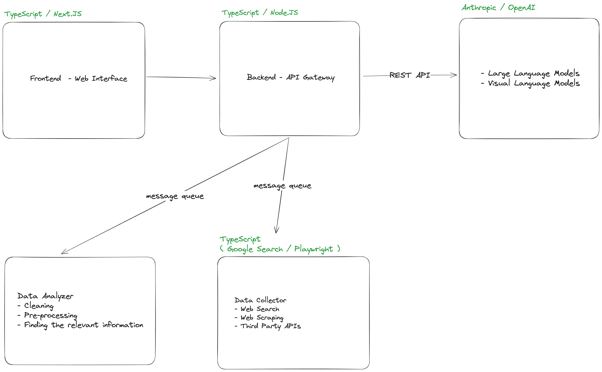

*Final Project for DTSA 5714 Course by Colorado Boulder*

### Personal Research Assistant

The product is a personalized AI research assistant that helps users collect, organize and summarize information from
the web.

It solves the problem of inefficient online research, where people often browse through dozens of tabs and struggle to
extract and organize insights.

The product will allow the users to submit a query, which will trigger an automated pipeline that scrapes data from
online sources, filters and analyzes it, and returns the structured summaries.

Targeted at students, researchers, and knowledge workers, the tool uses large language models to generate concise, and
context-aware answers. Unlike traditional search engines, it provides unified, high-quality insights instead of
scattered results.

----

#### White Board Architecture

Here is the diagram of the architecture that I initially thought of:

----

#### Consolidated Architecture

The actual implementation simplifies services from the initial design.

**Next.js Edge Runtime**

Hosts both the AI agent and backend API.  
Handles web search directly using Google Custom Search API.  
This eliminates the need for a separate Data Collector service for search operations.

**Next.js Frontend**

Simple for user interactions (unchanged from initial design).

**Web Scraping Service**

As Data Collector now only have the job to scrape the web pages, this is merged to data analyzer.  
And we named it web scraping service. It handles:

- Web scraping (fetching HTML from URLs)
- Content cleaning and pre-processing
- HTML-to-Markdown conversion for LLM consumption

**Open AI API**

OpenAI GPT-4o for large language model.  
Due to time constraint, I didn't apply the use of visual language model.  
If we ever gets a chance, this will greatly improve while analyzing the web pages for LLM.

**Message Queue**

RabbitMQ for `async` communication between the Edge Runtime and Web Scraper service.  
I didn't setup with docker or docker-compose as it doesn't add much value.  
Instead, I use a free cloud instance offered by https://cloudamqp.com